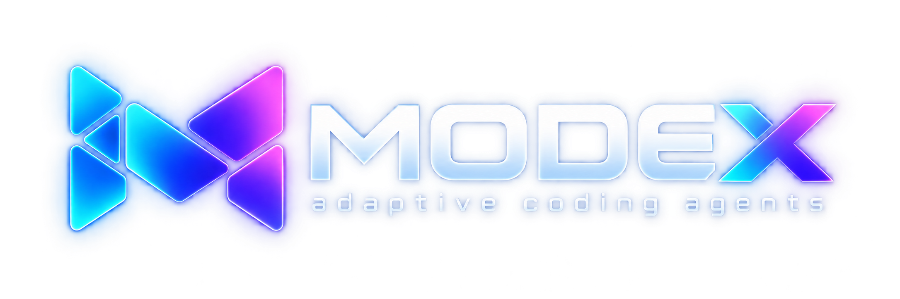
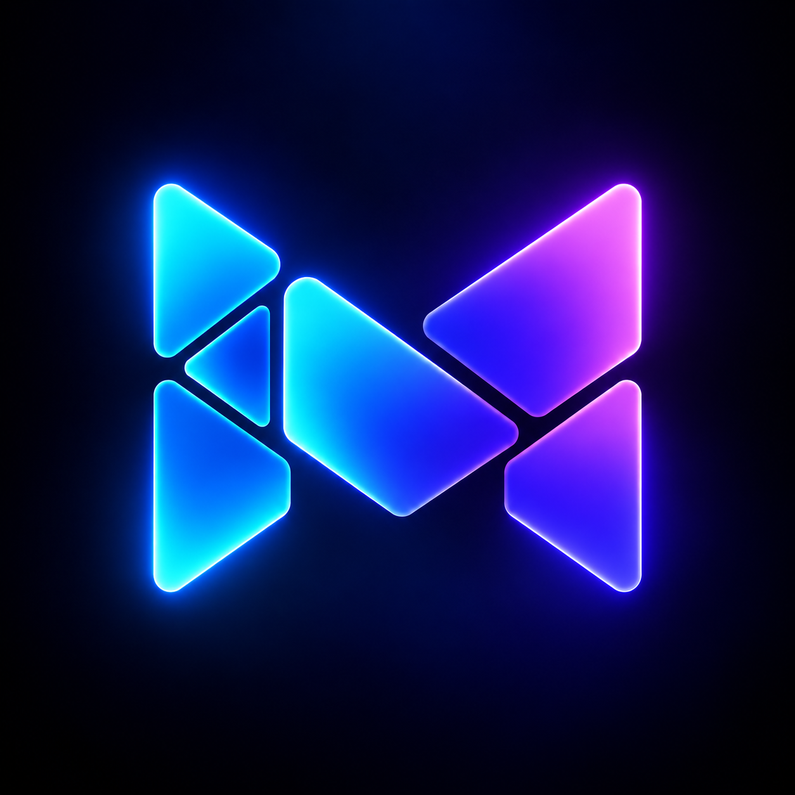
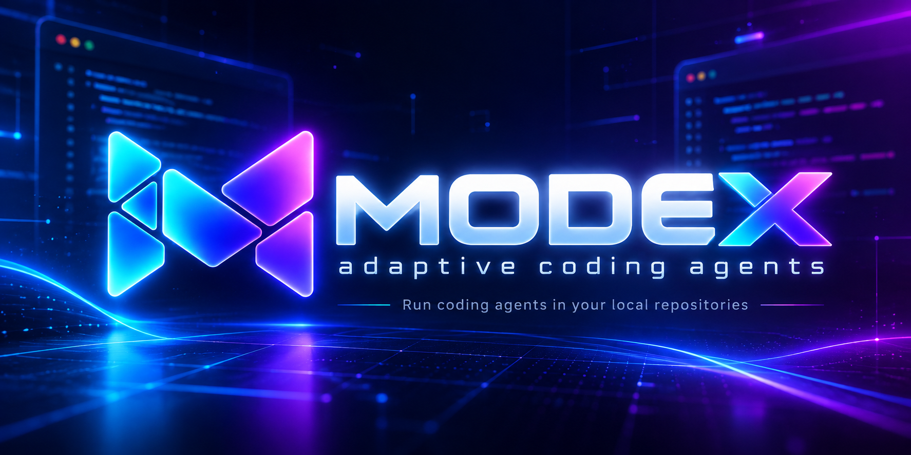

# Proposed Modex branding

Three AI-generated logo concepts offered for maintainer review. These are the original PNG exports; adoption and any further refinements are up to the maintainers.

| File | Intended use | Original dimensions |
| --- | --- | --- |
| `modex-header.png` | README header | 2172 × 724 |
| `modex-icon.png` | Square app/repo icon concept | 1254 × 1254 |
| `modex-social-preview.png` | Social preview concept | 1774 × 887 |

The icon and social preview have opaque backgrounds. The header is an RGBA PNG. These are raster concepts, not vector masters or packaged platform icons.

## Header

## Icon

## Social preview

